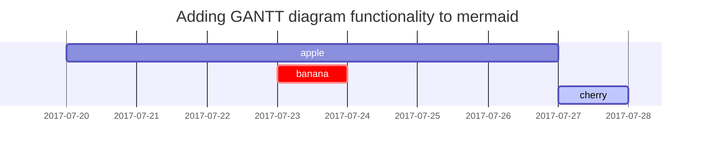

이 페이지는 내가 사용한 블로그 테마 [**Chirpy**](https://github.com/cotes2020/jekyll-theme-chirpy/fork),의 Text and Typography를 기본으로 작성했다. 블로그 작성 시 제목 규칙, 리스트 샘플을 확인할 수 있다.


## 제목(Titles)
---
# H1 - heading
## H2 - heading
### H3 - heading
#### H4 - heading

<h1 data-toc-skip>H1 - heading</h1>
<h2 data-toc-skip>H2 - heading</h2>
<h3 data-toc-skip>H3 - heading</h3>
<h4> H4 - heading</h4>
---
<br>

```markdown
---
<hr> 요소는 이야기 장면 전환, 구획 내 주제 변경 등,
문단 레벨 요소에서 주제의 분리를 나타냅니다.
---
# H1 - heading
## H2 - heading
### H3 - heading
#### H4 - heading

<h1 data-toc-skip>H1 - heading</h1>
<h2 data-toc-skip>H2 - heading</h2>
<h3 data-toc-skip>H3 - heading</h3>
<h4>H4 - heading</h4>
---
```

## 문단(Paragraph)

I wandered lonely as a cloud

That floats on high o'er vales and hills,

When all at once I saw a crowd,

A host, of golden daffodils;

Beside the lake, beneath the trees,

Fluttering and dancing in the breeze.

## 목록

### 정렬된 목록(Ordered list)

1. Firstly
2. Secondly
3. Thirdly

```markdown
1. Firstly
2. Secondly
3. Thirdly
```

### 정렬되지 않은 목록(Unordered list)

- Chapter
  - Section
    - Paragraph

```markdown
- Chapter
  - Section
    - Paragraph
```

### 작업 목록(Task list)

- [ ] 할일 목록
- [x] 완료
- [ ] Defeat COVID-19
  - [x] Vaccine production
  - [ ] Economic recovery
  - [ ] People smile again

```markdown

- [ ] TODO
- [x] Completed
- [ ] Defeat COVID-19
  - [x] Vaccine production
  - [ ] Economic recovery
  - [ ] People smile again

```

### 설명 목록(Description list)

Sun
: the star around which the earth orbits

Moon
: the natural satellite of the earth, visible by reflected light from the sun

```markdown

Sun
: the star around which the earth orbits

Moon
: the natural satellite of the earth, visible by reflected light from the sun

```

## 인용 블록(Block Quote)

> _인용문_ 을 사용할 때의 예시 입니다.

```markdown
> _인용문_ 을 사용할 때의 예시 입니다.
```

## 프롬프트(Prompts)

> 이 예제는 `팁` 아이콘을 사용한 프롬프트 입니다.
{: .prompt-tip }

> 이 예제는 `정보` 아이콘을 사용한 프롬프트 입니다.
{: .prompt-info }

> 이 예제는 `경고` 아이콘을 사용한 프롬프트 입니다.
{: .prompt-warning }

> 이 예제는 `위험` 아이콘을 사용한 프롬프트 입니다.
{: .prompt-danger }

```markdown
> 이 예제는 `팁` 아이콘을 사용한 프롬프트 입니다.
{: .prompt-tip }

> 이 예제는 `정보` 아이콘을 사용한 프롬프트 입니다.
{: .prompt-info }

> 이 예제는 `경고` 아이콘을 사용한 프롬프트 입니다.
{: .prompt-warning }

> 이 예제는 `위험` 아이콘을 사용한 프롬프트 입니다.
{: .prompt-danger }
```

## 테이블(Tables)

| Company                      | Contact          | Country |
|:-----------------------------|:-----------------|--------:|
| Alfreds Futterkiste          | Maria Anders     | Germany |
| Island Trading               | Helen Bennett    | UK      |
| Magazzini Alimentari Riuniti | Giovanni Rovelli | Italy   |

```markdown

| Company                      | Contact          | Country |
|:-----------------------------|:-----------------|--------:|
| Alfreds Futterkiste          | Maria Anders     | Germany |
| Island Trading               | Helen Bennett    | UK      |
| Magazzini Alimentari Riuniti | Giovanni Rovelli | Italy   |

```

## Links

<http://127.0.0.1:4000>

[깃허브 블로그 페이지 이동](https://keumbi.github.io/)

[깃허브 블로그 페이지 이동](https://keumbi.github.io/){:target="_blank"}
_새창으로 링크 열기 {} 사이에 html attribute 넣어 사용 가능_

```markdown
<http://127.0.0.1:4000>
[깃허브 블로그 페이지 이동](https://keumbi.github.io/)
<!-- 새창으로 링크 열기 -->
[깃허브 블로그 페이지 이동](https://keumbi.github.io/){:target="_blank"}
```

## 각주(Footnote)

옆에 훅을 클릭 시 하단 각주로으로 이동합니다.[^footnote], 또 다른 각주 예제2[^fn-nth-2].

```markdown
옆에 훅을 클릭 시 하단 각주로으로 이동합니다.[^footnote], 또 다른 각주 예제2[^fn-nth-2].
```

## 이미지

- 기본 (설명과 함께)

{: width="972" height="589" }
_전체 영역 넓비에 가득 차고, 가운데 정렬인 이미지_

```markdown
{: width="972" height="589" }
_Full screen width and center alignment_
```

<br>

- Shadow

{: .shadow width="1548" height="864" style="max-width: 90%" }
_shadow effect (visible in light mode)_
```markdown
{: .shadow width="1548" height="864" style="max-width: 90%" }
_shadow effect (visible in light mode)_
```
<br>

- Left aligned

{: width="972" height="589" style="max-width: 70%" .normal}
```markdown
{: width="972" height="589" style="max-width: 70%" .normal}
```
<br>

- Float to left

  {: width="972" height="589" style="max-width: 200px" .left}
  "A repetitive and meaningless text is used to fill the space. A repetitive and meaningless text is used to fill the space. A repetitive and meaningless text is used to fill the space. A repetitive and meaningless text is used to fill the space. A repetitive and meaningless text is used to fill the space. A repetitive and meaningless text is used to fill the space. A repetitive and meaningless text is used to fill the space. A repetitive and meaningless text is used to fill the space. A repetitive and meaningless text is used to fill the space. A repetitive and meaningless text is used to fill the space. A repetitive and meaningless text is used to fill the space. A repetitive and meaningless text is used to fill the space."
```markdown
이미지 왼쪽 정렬
 {: width="972" height="589" style="max-width: 200px" .left}
  "A repetitive and meaningless text is used to fill the space. A repetitive and meaningless text is used to fill the space. A repetitive and meaningless text is used to fill the space. A repetitive and meaningless text is used to fill the space. A repetitive and meaningless text is used to fill the space. A repetitive and meaningless text is used to fill the space. A repetitive and meaningless text is used to fill the space. A repetitive and meaningless text is used to fill the space. A repetitive and meaningless text is used to fill the space. A repetitive and meaningless text is used to fill the space. A repetitive and meaningless text is used to fill the space. A repetitive and meaningless text is used to fill the space."
```
<br>

- Float to right

  {: width="972" height="589" style="max-width: 200px" .right}
  "A repetitive and meaningless text is used to fill the space. A repetitive and meaningless text is used to fill the space. A repetitive and meaningless text is used to fill the space. A repetitive and meaningless text is used to fill the space. A repetitive and meaningless text is used to fill the space. A repetitive and meaningless text is used to fill the space. A repetitive and meaningless text is used to fill the space. A repetitive and meaningless text is used to fill the space. A repetitive and meaningless text is used to fill the space. A repetitive and meaningless text is used to fill the space. A repetitive and meaningless text is used to fill the space. A repetitive and meaningless text is used to fill the space."
```markdown
이미지 오른쪽 정렬
{: width="972" height="589" style="max-width: 200px" .right}
"A repetitive and meaningless text is used to fill the space. A repetitive and meaningless text is used to fill the space. A repetitive and meaningless text is used to fill the space. A repetitive and meaningless text is used to fill the space. A repetitive and meaningless text is used to fill the space. A repetitive and meaningless text is used to fill the space. A repetitive and meaningless text is used to fill the space. A repetitive and meaningless text is used to fill the space. A repetitive and meaningless text is used to fill the space. A repetitive and meaningless text is used to fill the space. A repetitive and meaningless text is used to fill the space. A repetitive and meaningless text is used to fill the space."
```
<br>

## Mermaid SVG



## Mathematics

The mathematics powered by [**MathJax**](https://www.mathjax.org/):

$$ \sum_{n=1}^\infty 1/n^2 = \frac{\pi^2}{6} $$

When $a \ne 0$, there are two solutions to $ax^2 + bx + c = 0$ and they are

$$ x = {-b \pm \sqrt{b^2-4ac} \over 2a} $$

## Inline code

This is an example of `Inline Code`.
```markdown
This is an example of `Inline Code`.
```

## Filepath

Here is the `/path/to/the/file.extend`{: .filepath}.
```markdown
Here is the `/path/to/the/file.extend`{: .filepath}.
```

## Code block

### Common

```
This is a common code snippet, without syntax highlight and line number.
```

### Specific Languages

#### Console

```console
$ env |grep SHELL
SHELL=/usr/local/bin/bash
PYENV_SHELL=bash
```

#### Shell

```bash
if [ $? -ne 0 ]; then
    echo "The command was not successful.";
    #do the needful / exit
fi;
```

### Specific filename

```sass
@import
  "colors/light-typography",
  "colors/dark-typography"
```
{: file='_sass/jekyll-theme-chirpy.scss'}
## 이모티콘
💪:muscle:🦾:mechanical_arm:🕛:clock12:🕧:clock1230:🔥:fire:👏:clap:🙌:raised_hands:👐:open_hands:🤲:palms_up_together:🤝:handshake:🙏:pray:👌:ok_hand:🤞:crossed_fingers:👋:wave: 😂:joy: 😭:sob: 💩:poop: ❤️:heart: 💥:boom: 💯:100: 💢:anger:💬:speech_balloon: 💫:dizzy: 💦:sweat_drops: 👉:point_right:🖕:fu: 👈:point_left:
```markdown
💪:muscle:🦾:mechanical_arm:
🕛:clock12:🕧:clock1230:🔥:fire:
👏:clap:🙌:raised_hands:👐:open_hands:🤲:palms_up_together:🤝:handshake
:🙏:pray:👌:ok_hand:🤞:crossed_fingers:👋:wave: 😂:joy: 😭:sob:
💩:poop: ❤️:heart: 💥:boom: 💯:100: 💢:anger:💬:speech_balloon: 💫:dizzy:
💦:sweat_drops: 👉:point_right:🖕:fu: 👈:point_left:
```

## 각주 연결(Reverse Footnote)

[^footnote]: The footnote source
[^fn-nth-2]: The 2nd footnote source
```markdown
[^footnote]: 각주에 대한 설명
[^fn-nth-2]: 각주 예제2 설명
```
