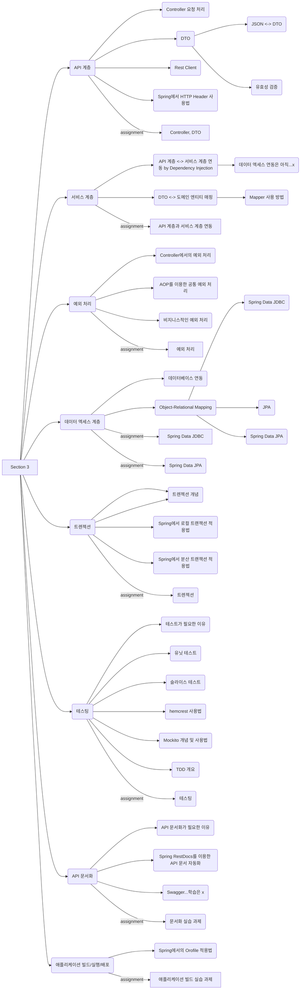

## Daily to-do list

- [x]  Zoom - 굿모닝 세션
- [x]  Daily Coding
- [x]  Chapter - 프로젝트 환경 구성
- [x]  점심시간
- [x]  Chapter - 핸들러 메서드 & Responseentity
- [x]  Chapter - [심화 학습] HTTP Header, Rest Client
- [x]  Pair - Controller 실습
- [x]  Zoom - Checkpoint

## 계획 단계

✅ **오늘 나의 학습 목표는 무엇인가요?**
- Spring MVC
  - Spring MVC란 무엇인지 이해할 수 있다.
  - Spring MVC의 동작방식과 구성요소를 이해할 수 있다.
- Controller
  - API 엔드 포인트인 Controller의 구성 요소를 이해할 수 있다.
  - 실제 동작하는 Controller의 기본 기능을 구현할 수 있다.
- DTO(Data Transfer Object)
  - DTO가 무엇인지 이해할 수 있다
  - DTO Validation이 무엇인지 이해할 수 있다.
  - Controller에 DTO 클래스를 적용할 수 있다.

✅ **오늘 학습할 내용 중에 이미 알고 있는 내용은 무엇인가요?** 없다!! 어려울것 같다!! ㅜㅜ

✅ **굿모닝 세션**
**권장하는 학습 방법**
* 가급적 **직접 타이핑**해서 코드에 익숙해지기
* 복사/붙여 넣기 안하기
* 학습 시작부터 레퍼런스 코드 활용하지 않기
* 이미 학습한 유닛에 대한 지속적 반복 학습
* **학습 컨텐츠에 없는 기능을 배운 내용으로 그대로 구현해보기**
* 페어 시간
  * 잘하는 사람과 페어 프로그래밍 시 주눅들지 않기. 배울게 있으면 배우면 됩니다.
  * 가벼운 페어 시간으로 즐기고 넘어가세요!

## Overview

웹브라우저나 모바일 기기 등의 클라이언트로부터 들어오는 요청을 직접적으로 전달 받게 되는 API 계층에 대한 학습을 진행하도록 하겠습니다.

## 실습 환경 구성
> 스마트폰의 앱처럼 사용자에게 직접적으로 보여지고 사용자가 직접 사용할 수 있는 애플리케이션을 프런트엔드(Frontend) 또는 클라이언트 측 애플리케이션이라고 합니다.
>
>
> 즉, 서버 측 자원(Resource)을 사용하는 쪽이 클라이언트가 되며, 이러한 클라이언트로는 **웹브라우저, 모바일 브라우저, 스마트폰 앱, 데스크 탑 애플리케이션 등**이 있습니다.
>
> 요즘은 매장에서 **키오스크** 화면을 통해 고객이 직접 셀프 주문도 할 수 있는데, 키오스크 역시 클라이언트의 하나라고 보면 되겠습니다.
>
> 백엔드 측의 애플리케이션은 **기본적으로 클라이언트의 유형과 무관하게 공통의 정보를 제공하도록 디자인이 되어야하지만 특정 클라이언트 유형에 맞는 정보를 추가적으로 제공하기 위한 확장을 고려해야하는 경우**도 빈번하다는 사실을 기억하길 바랍니다.
>

우리가 제작해야 할 샘플 애플리케이션은 바로 클라이언트 측에서 커피 주문을 위해 필요한 정보를 제공하기 위한 **서버용 웹 애플리케이션**이 되겠습니다.

> 사실 프랜차이즈 매장에서 고객이 주문할 수 있는 메뉴로 커피 이외에 햄버거, 콜라, 감자 튀김, 피자, 주스 등등 굉장히 많은것들이 있을텐데, 우리는 학습을 위해 다양한 메뉴 중에서 커피만 주문할 수 있는 것으로 기능을 제한하도록 하겠습니다.
>
>
> 이처럼 요구사항에 맞춰서 어떤 애플리케이션의 기능을 특정 범위로 제한하는 것을 **애플리케이션 경계**를 설정한다라고 합니다.
>

## 🔥 데일리 회고 - 점검 및 평가

정규학습시간을 마친 후에는 정규학습시간 전에 개인 블로그나 노트에 적어둔 계획 단계에 대한 답변과, 아래 질문에 대한 답변을 블로그나 노트에 추가로 작성해 봅니다.

  ✅ **오늘 학습 내용 중 새롭게 배운 내용은 무엇인가요?** Spring MVC, controller class

  ✅ **오늘 새롭게 학습한 내용을 다른 사람에게 설명할 수 있나요?** 할 수 없습니다!!

  ✅ **오늘 학습한 내용 중 아직 이해되지 않은 불확실한 내용은 무엇인가요?** 전부??

  ✅ **이해되지 않은, 불확실한 내용을 보완하기 위해서 나는 무엇을 할 수 있을까요?** 실습을 해보고 다시 점검해 보겠습니다.

  ✅ **나의 오늘 학습 만족도는 몇점인가요?** 🌑🌘🌗🌖🌕  **→**  🌗

## Reference
[StackEdit, play with Markdown](https://stackedit.io/app#)
