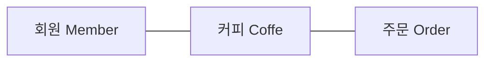

## Overview

Spring MVC 기반 웹 애플리케이션의 API 계층에서 사용되는, 클라이언트의 HTTP 요청을 직접적으로 전달 받는 Controller의 기능들을 알아보고 직접 코드로 구현해보도록 하겠습니다.


## 1. Controller 클래스 설계 및 구조 생성

### 1.1. 패키지 구조 생성
Spring Boot 기반의 애플리케이션에서 주로 사용되는 Java 패키지 구조는 기능 기반 패키지 구조(package-by-feature)와 계층 기반 패키지 구조(package-by-layer)가 있습니다.

#### 기능 기반 패키지 구조(package-by-feature)

**기능 기반 패키지 구조**란 말 그대로 애플리케이션의 패키지를 애플리케이션에서 구현해야 하는 기능을 기준으로 패키지를 구성하는 것입니다.

이렇게 나누어진 패키지 안에는 **하나의 기능을 완성하기 위한 계층별(API 계층, 서비스 계층, 데이터 액세스 계층)클래스들이 모여있습니다.**
- coffee
  - Coffee.java
  - CoffeeController.java
  - CoffeeDTO.java
  - CoffeeRepository.interface
  - CoffeeService.java
- member
  - Member.java
  - MemberController.java
  - MemberDto.java
  - MemberRepository.interface
  - MemberService.java

회원을 관리하기 위한 회원 기능과 커피를 관리하기 위한 커피 기능을 각각 coffee와 member라는 패키지로 나누었으며, 각각의 패키지 안에 레이어 별 클래스들이 존재합니다.


#### 계층 기반 패키지 구조(package-by-layer)

계층 기반 패키지 구조란 패키지를 하나의 계층(Layer)으로 보고 클래스들을 계층별로 묶어서 관리하는 구조를 말합니다.
- controller
  - CoffeeController.java
  - MemberController.java
- dto
  - CoffeeDTO.java
  - MemberDto.java
- member
  - Coffee.java
  - Member.java
- repository
  - CoffeeRepository.interface
  - MemberRepository.interface
- service
  - CoffeeService.java
  - MemberService.java

계층(Layer)을 기반으로 패키지를 구성한 예입니다. ‘controller, dto’ 패키지는 API 계층에 해당되고, ‘model, service’ 패키지는 비즈니스 계층에 해당되며, repository는 데이터 액세스 계층에 해당됩니다.

> Spring Boot 팀에서는 **테스트와 리팩토링이 용이하고, 향후에 마이크로 서비스 시스템으로의 분리가 상대적으로 용이**한 **기능 기반 패키지 구조** 사용을 권장하고 있습니다.


## 1.2. 커피 주문 애플리케이션의 Controller 설계

‘**클라이언트로부터 발생할 요청에는 어떤 것들이 있을까**’를 고민해보는 것입니다.

이 말을 서버 애플리케이션 입장에서 생각하면 ‘**클라이언트 요청을 처리할 서버 애플리케이션의 기능으로 뭐가 필요할까**’와 같습니다.

### 커피 주문 애플리케이션의 기능 요구 사항

고객이 커피를 주문하고 주문한 커피를 마시기 위해서는 아래와 같은 기능이 필요합니다.

- 주인이 커피 정보를 관리하는 기능
  - 커피 정보 등록 기능
  - 등록한 커피 정보 수정 기능
  - 등록한 커피 정보 삭제 기능
  - 등록한 커피 정보 조회 기능
- 고객이 커피 정보를 조회하는 기능
  - 커피 정보 조회 기능
- 고객이 커피를 주문하는 기능
  - 커피 주문 등록 기능
  - 커피 주문 취소 기능
  - 커피 주문 조회 기능
- 고객이 주문한 커피를 주인이 조회하는 기능
  - 커피 주문 조회 기능
  - 고객에게 전달 완료한 커피에 대한 주문 완료 처리 기능

위 기능들에 대한 Controller 클래스를 작성하려면 총 몇개의 Controller 클래스가 필요할까요?

> 애플리케이션 구현에 있어서 정답이란 존재하지 않지만 더 나은 해결책을 찾기 위한 접근법이나 패턴은 존재합니다.

### 커피 주문 애플리케이션에 필요한 리소스

REST API 기반의 애플리케이션에서는 일반적으로 애플리케이션이 제공해야 될 기능을 **리소스(Resource, 자원)**로 분류합니다.



## 1.3. 엔트리포인트(Entrypoint) 클래스 작성

Spring Boot 기반의 애플리케이션이 정상적으로 실행되기 위해서 가장 먼저 해야될 일은 main() 메서드가 포함된 애플리케이션의 엔트리포인트(Entrypoint, 애플리케이션 시작점)를 작성하는 것입니다.

하지만 여러분들이 ‘Spring Initializr’를 통해 생성한 프로젝트에는 엔트리포인트 클래스가 이미 작성되어 있습니다.

```java
package com.code;

import org.springframework.boot.SpringApplication;
import org.springframework.boot.autoconfigure.SpringBootApplication;

@SpringBootApplication   // (1)
public class Section3Week1Application {

	public static void main(String[] args) {
    // (2)
		SpringApplication.run(Section3Week1Application.class, args);
	}

}
```

**(1) `@SpringBootApplication`**

`@SpringBootApplication` 은 코드 상에서는 보이지 않지만 내부적으로 세가지 일을 해줍니다.

- 자동 구성을 활성화합니다.
- 애플리케이션 패키지 내에서 `@Component`가 붙은 클래스를 검색한 후(scan), **Spring Bean**으로 등록하는 기능을 활성화합니다.
- `@Configuration` 이 붙은 클래스를 자동으로 찾아주고, 추가적으로 Spring Bean을 등록하는 기능을 활성화합니다.

**(2) `SpringApplication.run(Section3Week1Application.class, args);`**

Spring 애플리케이션을 부트스트랩하고, 실행하는 역할을 합니다.

> 부트스트랩(Bootstrap)이란?
>
> 애플리케이션이 실행되기 전에 여러가지 설정 작업을 수행하여 실행 가능한 애플리케이션으로 만드는 단계를 의미합니다.
>

## 1.4. 커피 주문 애플리케이션의 Controller 구조 작성

이제 커피 주문 애플리케이션에 기본적으로 필요한 세 개의 Controller 구조를 만들어 보도록 하겠습니다.

### MemberController 구조 작성

```java
package com.code.member;

import org.springframework.web.bind.annotation.RequestMapping;
import org.springframework.web.bind.annotation.RestController;

@RestController   // (1)
@RequestMapping("/v1/members")   // (2)
public class MemberController {
}
```

✔️ **코드 설명**

`(1) @RestController`

- Spring MVC에서는 특정 클래스에 `@RestController` 를 추가하면 해당 클래스가 REST API의 리소스(자원, Resource)를 처리하기 위한 API 엔드포인트로 동작함을 정의합니다.
- 또한 `@RestController` 가 추가된 클래스는 애플리케이션 로딩 시, Spring Bean으로 등록해줍니다.

`(2) @RequestMapping`

- `@RequestMapping` 은 클라이언트의 요청과 클라이언트 요청을 처리하는 **핸들러 메서드(Handler Method)를 매핑**해주는 역할을 합니다.

> @RequestMapping 은 Controller 클래스 레벨에 추가하여 클래스 전체에 사용되는 공통 URL(Base URL) 설정을 합니다.


### CoffeeController 구조 작성

> CoffeeController 클래스는 ‘src/main/java/com/codestates/coffee’ 패키지를 생성해서 그 안에 작성합니다.


```java
package com.code.coffee;

import org.springframework.web.bind.annotation.RequestMapping;
import org.springframework.web.bind.annotation.RestController;

@RestController
@RequestMapping("/v1/coffees")
public class CoffeeController {
}
```

커피 정보 관리를 위한 CoffeeController

✔️ **코드 설명**

앞에서 설명한 내용과 중복되으로 별도 설명은 생략합니다.

### OrderController 구조 작성

> Controller 클래스의 구조만 작성했기 때문에 아직은 미완성 Controller입니다.


## 핵심 포인트

- Spring Boot 애플리케이션으로서 동작하기 위한 엔트리포인트에는 `@SpringBootApplication`을 추가한다.
- main() 메서드 내에서 `SpringApplication.run()`을 호출하면 Spring Boot 기반의 애플리케이션으로 동작한다.
- `@RestController`를 클래스에 추가함으로써 해당 클래스를 REST API의 리소스(자원, Resource)를 처리하기 위한 API 엔드포인트로 동작하게 해준다.
- `@RequestMapping`을 Controller 클래스 레벨에 추가하여 클래스 전체에 사용되는 공통 URL(Base URL)을 설정할 수 있다.


## Reference
[RESTful API의 URI 작성 규칙](https://itvillage.tistory.com/35)

[@SpringBootApplication 의 역할](https://itvillage.tistory.com/36)

[Spring Boot 애플리케이션의 부트스트랩(Bootstrap) 과정](https://itvillage.tistory.com/37)
