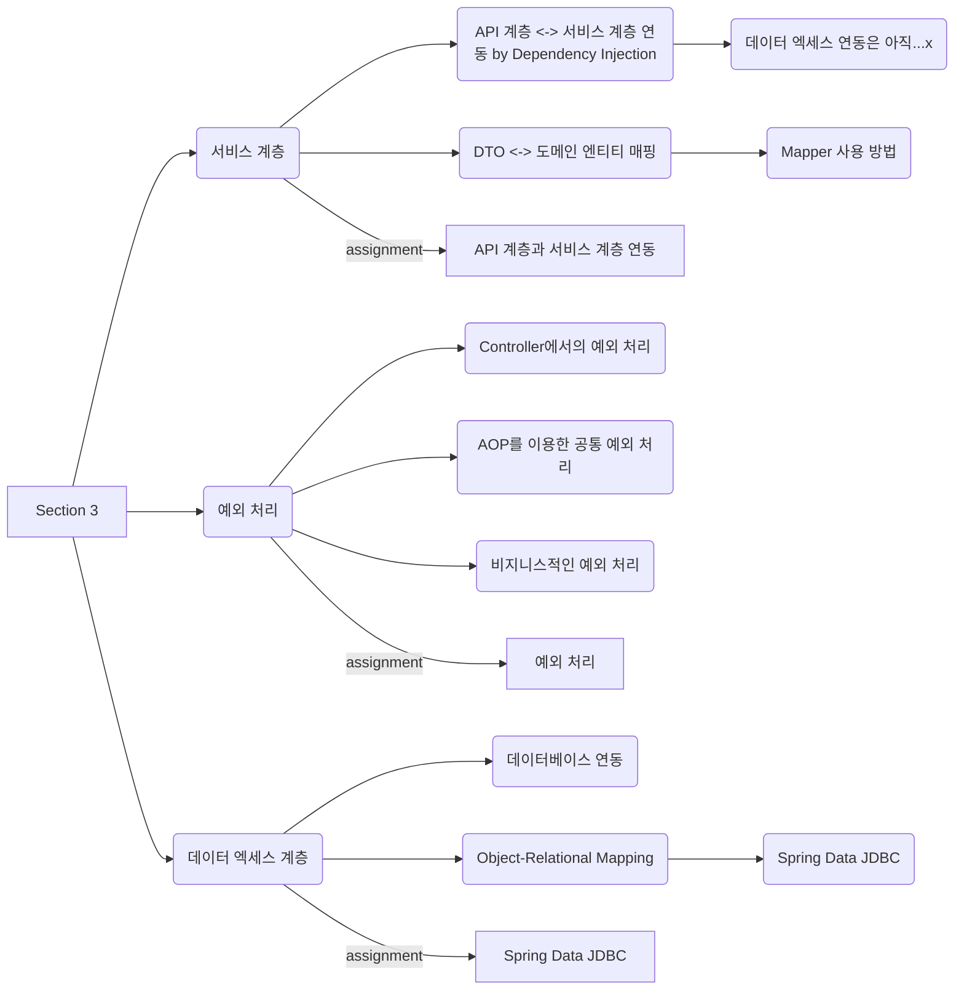

{: .shadow style="max-width: 80%" }

## Overview
벌써 코스를 시작한 지 11주가 지나간다.

앞으로 반이 남았지만, 프로젝트 기간을 빼고 생각하면 코스도 얼마 남지 않았다.

섹션2 회고 때 마음먹었던, 주간 리뷰를 소소하게 적어보려고 한다.

**4L: Liked, Learned, Lacked, Longed for**

## 😍 좋았던 것(Liked)
스터디 모각코 참여: 누군가 지켜보고 있다!! 화면 공유한다거나 하는 건 아니지만 모각코에 들어가 있다는 마음가짐을 다지며, 뽀모도로 앱을 사용해 쉬는 시간을 제외하고 집중해서 학습하려고 한 점이 아주 좋았다. :)

## 📚 배운 것(Learned)

학습의 흐름을 정리하는 데 도움이 된 것 같다. 나중에 데이터 테이블도 만들어봐야지~

## 💦 부족했던 것(Lacked)
섹션2 회고에서 계획했던 최우선 과제를 놓치고 있었다.

실습 위주로 진행되면 노션에 정리가 미흡했다. 100% 내가 이해하지 못한 부분이 많아서 그랬던 것 같다. 다른 동료 블로그를 읽어보면서 같은 콘텐츠를 보면서 이해도가 이렇게 다를 수 있구나! 또 한 번 공부의 의지를 다져봤다.

운동하기: 늦은 저녁에 집중도가 높은 것 같아서 밤늦게까지 공부하는 경우가 많아졌다. 기존 생활 방식이 깨지면서 아침 요가는 상상도 못 할 일이 돼 버렸다. 수영 못 가는 날은 꼭!! 아침에 요가를!! 공부할 마음의 준비라고 생각하면 해야지!!

## 🕯 바라는 것(Longed for)
학습 시간에는 지금 하는 콘텐츠에 집중!!
인프런 강의 구매한 부분 하루에 1강 이상 보고 내용 정리해 보기!!
부족한 부분 저녁에 정리하기!!

## Reference
[The Four Ls retrospective](https://www.teamretro.com/retrospectives/4ls-retrospective)

