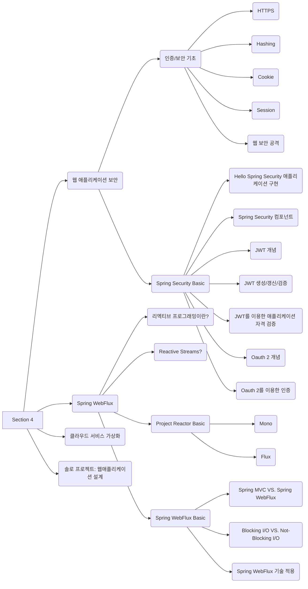

## Daily to-do list

- [x]  Zoom- 굿모닝 세션
- [x]  Daily Coding
- [x]  Chapter - Spring Data JDBC를 이용한 데이터 액세스 실습
- [x]  점심시간
- [x]  Chapter - Spring Data JDBC를 이용한 데이터 액세스 실습
- [x]  Pair - Spring Data JDBC를 이용한 데이터 액세스 실습
- [x]  Zoom - Checkpoint
- [x]  Survey - Pair Review & Unit Review

## 계획 단계

✅ **오늘 나의 학습 목표는 무엇인가요?**

- 암호화와 hashing, salting 등의 개념을 이해할 수 있다.
- HTTP와 HTTPS의 차이점을 이해할 수 있다.
- 권한 부여(Authorization)와 인증(Authentication)에 대해 이해할 수 있다.
- 쿠키의 작동 원리를 이해할 수 있다.
- 클라이언트, 서버, 데이터베이스의 전체 동작을 이해할 수 있다.
- 서비스의 보안과 관련된 방법을 알아보고 원리 및 장점 및 단점을 이해할 수 있다.

✅ **오늘 학습할 내용 중에 이미 알고 있는 내용은 무엇인가요?**

HTTP와 HTTPS의 차이, 쿠키??

✅ **굿모닝 세션**

Https는 어떤 암호화 방식을 사용할까?

두 가지 모두 사용(대칭, 비대칭)

- 인증서 - **전자서명**
- 클라이언트에서 만든 **대칭키**
- 대칭키를 암호화하여 전달 - **비대칭키(공개키) 암호화**

🤝 핸드쉐이크라고 한다

서버 → 클라이언트 인증서 보냄

공개키로 복호화 하려면 개인키를 ??

클라이언트: 인증서 검증

클라이언트 (대칭키 만듦) → 서버의 공개키로 잠글 수 있는 상자

서버: 서버의 개인키로 복호화 → 내용물이 클라이언트의 대칭키 (비밀리에 서버까지 온거다)

🤝 핸드쉐이크 끝남 주고 받을 때 대칭키로 왔다갔다 한다.

Q&A

Q. 클라이언트가 서버에게 헬로 요청

서버는 클라이언트에게 인증서를 포함해서 헬로 응답

클라이언트가 내장된 CA 리스트를 보고 인증서를 확인한다.

클라이언트가 CA의 공개키로 복호화를 통해 인증서를 검증했다면 클라이언트는 대칭키를 만든다.

이 대칭키를 서버의 공개키로 암호화해서 서버에 전달한다.

그럼 서버는 서버의 개인키로 복호화하여 클라이언트의 대칭키를 확인한다.

서버는 클라이언트의 대칭키로 샘플 데이터를 암호화해서 클라이언트에게 보내서 확인한다.

클라이언트는 서버에게 받은 데이터를 대칭키로 복호화해서 서로 대칭키를 잘 가지고 있는지 확인한다

이 후에는 클라이언트와 서버는 서로 대칭키로 암호화와 복호화를 진행하여 데이터를 전송한다

HTTPS 통신 시작을 위한 SSL 핸드 쉐이크 과정을 정리해봤는데 이게 맞을까요...?

A. 네 맞습니다.

## Overview

## 1. [HTTPS](/posts/security-authentication/#1-https)

## 2. [Hashing](/posts/security-authentication/#2-hashing)

## 3. [Cookie](/posts/security-authentication/#3-cookie)

## 4. [Session](/posts/security-authentication/#4-session)

## 5. [웹 보안 공격](/posts/security-authentication/#5-웹-보안-공격)

## 복호화

복호화 또는 디코딩(decoding)은 부호화(encoding)된 데이터를 부호(code)화 되기 전 형태로 바꾸어, 사람이 읽을 수 있는 형태로 되돌려놓는 것이다.

암호화(encryption)의 반대말로서의 복호화는 decryption이라고 부른다.

영어로는 decoding과 decryption이 구분되지만 한국어로는 구분이 되지 않는다.

암호화와 복호화에 같은 열쇠를 사용하는 것을 대칭 열쇠 암호(symmetric-key algorithm)라고 하고, 암호화와 복호화에 다른 열쇠를 사용하는 것을 공개 열쇠 암호(public-key cryptography) 또는 비대칭 열쇠 암호라고 한다.

대칭 키 암호는 암호화와 디코드가 빠르지만 다른 사람에게 암복호화에 쓰이는 열쇠를 안전하게 전달할 방법이 없고, 공개 키 암호는 다른 사람에게 암호화에 필요한 열쇠를 안전하게 전달할 수 있지만 암복호화에 시간이 오래 걸린다.

대칭 키 암호의 대표적인 게 AES이고, 공개 키 암호의 대표적인 게 RSA이다

출처: 나무위키

## 🔥 점검 및 평가

정규학습시간을 마친 후에는 정규학습시간 전에 개인 블로그나 노트에 적어둔 계획 단계에 대한 답변과, 아래 질문에 대한 답변을 블로그나 노트에 추가로 작성해 봅니다.

  ✅ **오늘 학습 내용 중 새롭게 배운 내용은 무엇인가요?** Hashing, Salt, rainbow table...

  ✅ **오늘 새롭게 학습한 내용을 다른 사람에게 설명할 수 있나요?** 네 아마도 60% 정도..

  ✅ **오늘 학습한 내용 중 아직 이해되지 않은 불확실한 내용은 무엇인가요?** 쿠키, 세션 실제 구현하려면 어떤 프로세스가 진행 되는지 감이 오지 않는다.

  ✅ **이해되지 않은, 불확실한 내용을 보완하기 위해서 나는 무엇을 할 수 있을까요?**
  [쿠키, 세션, 캐시가 뭔가요?](https://www.yalco.kr/15_cookie_session_cache/) 보고 정리하기, 컨텐츠 복습

  ✅ **나의 오늘 학습 만족도는 몇점인가요?** 🌑🌘🌗🌖🌕  **→**  🌖

## Reference

[복호화-나무위키](https://namu.wiki/w/%EB%B3%B5%ED%98%B8%ED%99%94)
