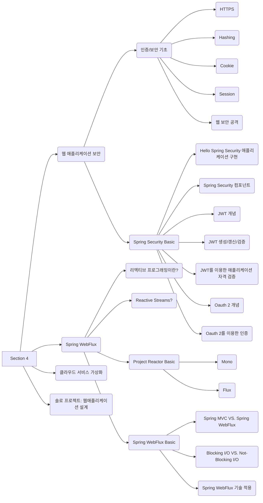

{: .shadow style="max-width: 80%" }
_Great job!! but I'm dizzy..._

## Overview
섹션 4... Spring 순삭!!

KPT를 기반으로 작성해 보겠다.
Keep: 좋았던 부분, 계속 유지됐으면 하는 부분

Problem: 잘 안되었던 부분, 문제라고 생각하는 부분

Try: Problem을 해결할 수 있도록 실천해 보았으면 하는 부분

## 1. 목표 상기하기
1. 가장 시급하면서 가장 빠르게 시도할 수 있는 것
  * 노션에 매일 공부 계획, 내용 정리
  * 시간 관리 뽀모도로 크롬익스텐션 사용, 25분 공부/ 5분 휴식, 노션에 체크
  * 일찍 자고 일찍 일어나는 습관!! 잠자는 시간 트레킹 후 노션에 체크
  * 매일 학습 만족도 체크
2. 시급하지만 시도하는 데 시간이 걸리거나, 빠르게 시도가 가능하지만 시급하지 않은 것
  * 노션에 정리한 내용 중 한가지 이상 블로그에 작성
  * 인프런 강좌 하루에 1강
  * 운동!! 요가 30분!!
  * 알고리즘문제 하루에 1개씩 풀기
3. 시급하지 않고 시도하는데 시간이 걸리는 것
  * 책읽기 읽고 싶은 책, 읽고 있는 책, 읽은 책 노션에 체크 (개발 서적 위주로!! ㅠㅠ)
  * 매주 4L로 체크하는 시간 갖기

## 2. Keep, Problem

### 2.1. Keep 작성을 위한 질문
>목표를 달성하기 위해 시도했던 것 중 가장 효과적이었던 노력은 무엇인가요? 
>목표를 달성하기 위해 했던 모든 노력 중 반드시 유지해야 할 것은 무엇인가요?

* 1일 1커밋
* 블로그 작성 및 업데이트
* 정규세션 시작전 배울 내용 점검 및 계획 세우기
* 매일 운동 30분 이상

### 2.2. Problem 작성을 위한 질문

>목표를 달성하기 위해 세웠던 계획 중 가장 유지하기 어려웠던 것은 무엇인가요? 
>목표를 달성하는 데 있어서 가장 큰 장애물은 무엇인가요?

* 매일 그날 배운 내용 정리하기
* 알고리즘
* 정규 학습 시간에 콘텐츠에 집중하기
* 시간 관리
* 책 읽기

## 3. Try 작성을 위한 질문
*Try를 작성하면서 반드시 주의해야 할 것은 지속해서 실천할 수 있어야 한다.*

>목표를 달성하기 위해 반드시 제거해야 하는 장애물이 있다면, 어떻게 제거할 수 있을까요?  
>목표를 달성하기 위해 계속해서 유지해야 할 노력이 있다면 무엇인가요?

* 노션에 매일 공부 계획, 내용 정리
* 노션에 정리한 내용 중 한 가지 이상 블로그에 작성
* 시간관리 뽀모도로 크롬익스텐션 사용, 25분 공부/ 5분 휴식, 노션에 체크
* 일찍 자고 일찍 일어나는 습관!! 잠자는 시간 노션에 체크
* 운동!! 요가 30분!!
* 책 읽기:sup: 읽고 싶은 책, 읽고 있는 책, 읽은 책 노션에 체크 (개발 서적 위주로!!)
* 매일 학습 만족도 체크
* 알고리즘 문제 하루에 1개씩 풀기
* 인프런 강좌 하루에 1강

## 4. 우선순위 정하기
1. 가장 시급하면서 가장 빠르게 시도할 수 있는 것
   * 노션에 매일 공부 계획, 내용 정리
   * 시간 관리 뽀모도로 크롬익스텐션 사용, 25분 공부/ 5분 휴식, 노션에 체크
   * 일찍 자고 일찍 일어나는 습관!! 잠자는 시간 트레킹 후 노션에 체크
   * 매일 학습 만족도 체크
2. 시급하지만 시도하는 데 시간이 걸리거나, 빠르게 시도가 가능하지만 시급하지 않은 것
   * 노션에 정리한 내용 중 한가지 이상 블로그에 작성
   * 인프런 강좌 하루에 1강
   * 운동!! 요가 30분!!
   * 알고리즘문제 하루에 1개씩 풀기
3. 시급하지 않고 시도하는데 시간이 걸리는 것
   * 책읽기 읽고 싶은 책, 읽고 있는 책, 읽은 책 노션에 체크 (개발 서적 위주로!! ㅠㅠ)
   * 매주 4L로 체크하는 시간 갖기

## 섹션 4 총평
위에 내용은 섹션 3과 동일하다. 3주 정도 기상 미션을 진행했었는데, 꾸준히 진행해서 새벽에 알찬 시간을 보낼 수 있었던 거 같다. 써프라이즈 우수 참가자 커피 쿠폰도 받았다~~ 예쓰!! 더불어 아침을 부지런히 보냈다는 마을의 위안... :)

다음 섹션인 프리 프로젝트의 압박이 계속 마음을 무겁게 하지만, 꾸준히 조금씩 조금씩 성장하고 있는 모습에 힘을 내보려 한다! 함께 참여하고 있는 동료들 분위기도 너무 좋고, 떨리는 마음으로 프리 프로젝트를 기다려 봐야겠다.

아래 내용 다시 살펴보고 체크하기!!

Spring MVC
- [ ]  API 계층
- [ ]  서비스 계층
- [ ]  예외 처리
- [ ]  JDBC 기반 데이터 액세스 계층
- [ ]  JPA 기반 데이터 액세스 꼐층
- [ ]  트랜잭션 (Transaction)
- [ ]  테스팅 (Testing)
- [ ]  API 문서화
- [ ]  애플리케이션 빌드/ 실행/ 배포
- [ ]  [인증/보안]기초
- [ ]  [Spring Security] Spring Security 기본
- [ ]  [Spring Security] JWT 인증(Authentication)
- [ ]  [Spring Security] OAuth2 인증(Authentication)
- [ ]  [Spring WebFlux] 리액티브 프로그래밍
- [ ]  [Spring WebFlux] Project Reactor
- [ ]  [Spring WebFlux] Spring WebFlux
- [ ]  [Cloud] 운영 환경 구성
- [ ]  [Cloud] 배포 컨테이너
- [ ]  [Cloud] 배포 자동화
- [ ]  [Cloud] 운영전략
- [ ]  [Solo Project]

## Reference
[우아한형제들 기술블로그- 팀 문화의 탄생](https://techblog.woowahan.com/2677/)

[Retrospective method KPT](https://code-artisan.io/retrospective-method-kpt/)

[생각정리 by 향로](https://jojoldu.tistory.com/302)
